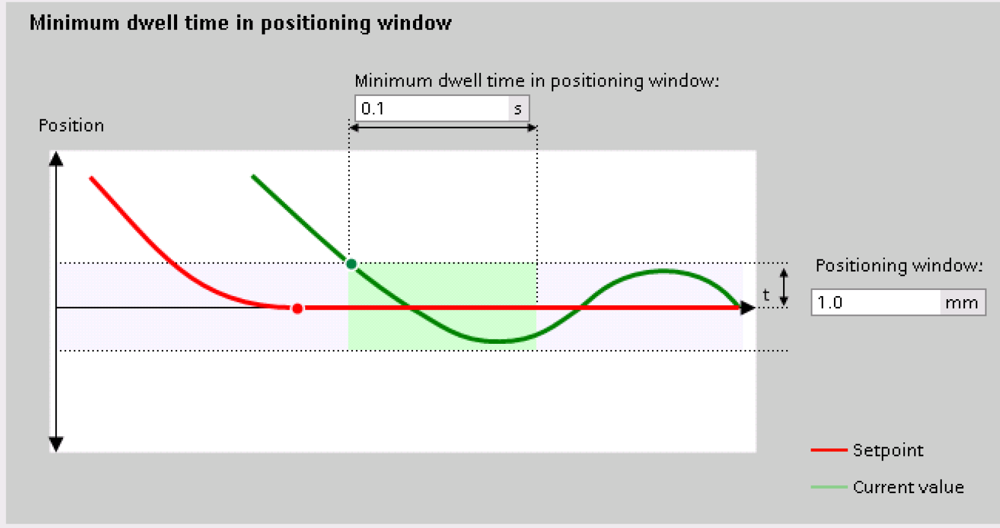
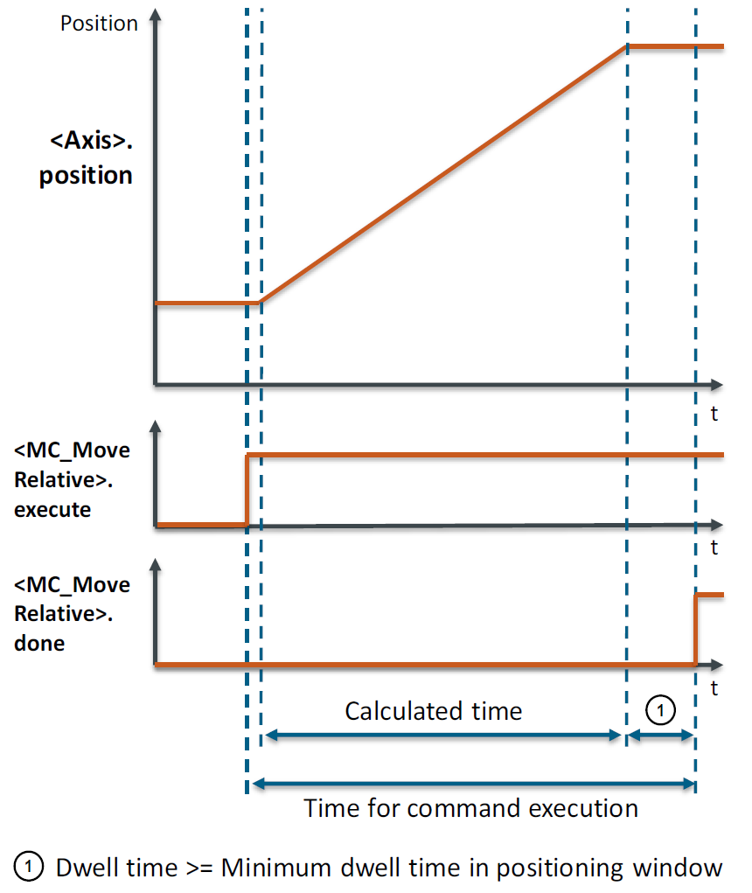

# LCalcMC Library for SIMATIC AX

## Overview

The LCalcMC library provides functions to get detailed information about motion profiles.

When moving axes in production machines, the following questions are of particular interest:

- How much time will a positioning take?
- How long does it take to reach the target velocity?
- How much distance is traveled when a velocity change is commanded?
- What acceleration is needed to complete a positioning in a certain time?
- When must a movement be stopped at the latest to avoid a crash (collision monitoring)?
- How can maximum required power be reduced?
- How can the jerk be limited to achieve minimal wear on the machine?

The library LCalcMC for SIMATIC provides easy-to-use calculation functions that help the user to find solutions to the above questions.
The function results can be used for programming the motion profiles with respect to the dynamics (velocity, acceleration, deceleration, jerk).

The library is a direct conversion of the functionally identical library [LCalcMC](https://support.industry.siemens.com/cs/ww/en/view/109475569) for use inside the TIA Portal

## Mode of Operation

### Blocks for change of velocity

A change of velocity or a stop at an axis (`MC_MoveVelocity`, `MC_MoveJog` or `MC_Halt`) can be calculated with the `LCalcMC_MoveVelocity` blocks. Therefore, dynamics (velocity and acceleration) that are effective at the start of the movement are taken into account at the inputs _startVelocity_ and _startAcceleration_. With the dynamic values provided at the inputs _acceleration_, _deceleration_ and _jerk_ and a target velocity at the input velocity the movement can be calculated in time or distance. In addition, the blocks can also calculate the required dynamic values with a known time or distance.

#### Overview of functions for velocity change from start dynamics to constant velocity

| Function name | Start dynamics |  | Target | Dynamic values |  |  |  |  |
|---------------|----------------|--|--------|----------------|--|--|--|--|
|               | Velocity | Acceleration | Velocity | Acceleration | Deceleration | Jerk | Time | Distance |
| `LCalcMC_MoveVelocityTime` | IN | IN | IN | IN | IN | IN | OUT | - |
| `LCalcMC_MoveVelocityDistance` | IN | IN | IN | IN | IN | IN | - | OUT |
| `LCalcMC_MoveVelocityDetails`¹ | IN | IN | IN | IN | IN | IN | OUT | OUT |
| `LCalcMC_MoveVelocityAccelByTime` | IN | IN | IN | OUT | OUT | IN | IN | - |
| `LCalcMC_MoveVelocityAccelByDistance` | IN | IN | IN | OUT | OUT | IN | - | IN |
| `LCalcMC_MoveVelocityJerkByTime` | IN | IN | IN | IN | IN | OUT | IN | - |
| `LCalcMC_MoveVelocityJerkByDistance` | IN | IN | IN | IN | IN | OUT | - | IN |

¹ partial times and distances including the corresponding velocities and accelerations are output

### Blocks for positioning

The calculation of positioning motion (`MC_MoveAbsolute`, `MC_MoveRelative` or `MC_MoveSuperimposed`) is done by the `LCalcMC_Positioning` blocks. The input parameter _distance_ represents the distance between start and end position of the movement. The blocks can calculate the time for the movement from standstill to standstill of the axis. For this the dynamic values (velocity, acceleration, deceleration and jerk) are taken into account. In addition, the blocks can also calculate the required dynamic values with a known time.

#### Overview of functions for positioning from standstill to standstill

| Function name | Velocity | Acceleration | Deceleration | Jerk | Time | Distance |
|---------------|----------|--------------|--------------|------|------|----------|
| `LCalcMC_PositioningTime` | IN | IN | IN | IN | OUT | IN |
| `LCalcMC_PositioningDetails`² | IN | IN | IN | IN | OUT | IN |
| `LCalcMC_PositioningAccel` | IN | OUT | OUT | IN | IN | IN |
| `LCalcMC_PositioningJerk` | IN | IN | IN | OUT | IN | IN |

² partial times and distances including the corresponding velocities and accelerations are output

## Requirements

- SIMATIC AX
- S7-1500T CPU with firmware version 2.9 or higher

## Installation

Install with Apax:

```cli
apax add @simatic-ax/lcalcmc
```

## Namespace

```cli
Simatic.Ax.LCalcMC;
```

## Documentation

Comprehensive documentation is available in the [docs](./docs) directory:

## Operation

**_NOTE:_** To get the best results at calculation when using technology objects, the setpoint values like _\<axis>.velocity_ and _\<axis>.acceleration_ have to be used as start values for the blocks.

## Error handling

Errors of LCalcMC functions are signalized at the return value of the different functions. A value WORD#16#8xxx (with x for hexadecimal 0 to F) at the return value signalizes an error.

The error codes are defined in [`LCalcMC_ErrorIDs`](./docs/constants/LCalcMC_ErrorIDs.md).

There are different kinds of errors:

**Errors at input values (16#82xx)**:

The values at the inputs are not correct.
The following questions can help to find the problem:

- Are the correct variables connected to the inputs?
- Are the values of the inputs in the same value range as the corresponding technology object value (typically 0.0 to 1.0e12)?

**Errors at calculation caused by input values (16#84xx)**:

With the provided input values a solution cannot be found in the calculation block.
The following questions can help to find the problem:

- Are the correct variables connected to the inputs?
- Can the input values be changed (e.g. increase time)?

**_NOTE:_** If the input values are too big, the block is not able to calculate.

## Additional Information

### Difference between calculated and executed motion profile

It may happen that there is a difference between the calculated motion and the motion that is executed by the PLC.
An axis has different monitoring functionalities, like positioning monitoring.
These functionalities delay the flags at the motion control commands that signalize the successful execution of the motion control command like the outputs _inVelocity_ and _done_.

For example, if a positioning command is used, the _done_ signal will be delayed at least according to the settings in positioning monitoring.





## Contribution

Thanks for your interest in contributing. Anybody is free to report bugs, unclear documentation, and other problems regarding this repository in the Issues section

## License and Legal information

Please read the [Legal information](./LICENSE.md)
