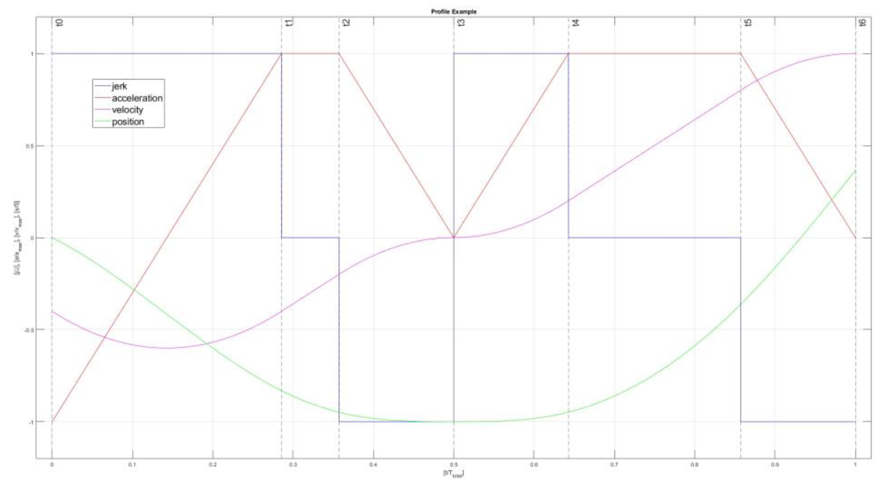

# LCalcMC_MoveVelocityDetails

## Principle of operation

The function `LCalcMC_MoveVelocityDetails` calculates the total time and total distance as well as part times, part distances, velocities and accelerations at the kink points of the acceleration. The dynamic values are taken into account (startVelocity, startAcceleration, acceleration, deceleration, jerk).

This example shows a motion profile of a reversing `MC_MoveVelocity` command, where the motion starts with a negative velocity and ends with a positive velocity. The first part of the movement is from negative velocity to standstill t0 - t3 and the second part of the movement is from standstill to positive velocity t4 - t6. The second part is valid only when a reverse movement is performed. In the picture the position is shown and not the distance traveled.

## Interface

### Input Parameters

| Parameter | Type | Description |
|-----------|------|-------------|
| `startVelocity` | `LREAL` | Velocity setpoint at start of motion command |
| `startAcceleration` | `LREAL` | Acceleration setpoint at start of motion command |
| `velocity` | `LREAL` | Velocity setpoint at end of motion command |
| `acceleration` | `LREAL` | Acceleration of motion command |
| `deceleration` | `LREAL` | Deceleration of motion command |
| `jerk` | `LREAL` | Jerk of motion command (Value = 0.0: Trapezoid velocity profile) |

### Output Parameters

| Parameter | Type | Description |
|-----------|------|-------------|
| `moveVelocityDetails` | [`LCalcMC_typeMoveVelocityDetails`](../types/LCalcMC_typeMoveVelocityDetails.md) | Calculated times, distances, velocities and accelerations between start and end of motion command |

### Return Value

| Parameter | Type | Description |
|-----------|------|-------------|
| `LCalcMC_MoveVelocityDetails` | `WORD` | Status of the function; WORD#16#0000: Calculation finished successfully   WORD#16#8000 - WORD#16#FFFF: Error identification |

The error codes are defined in [`LCalcMC_ErrorIDs`](../constants/LCalcMC_ErrorIDs.md).
